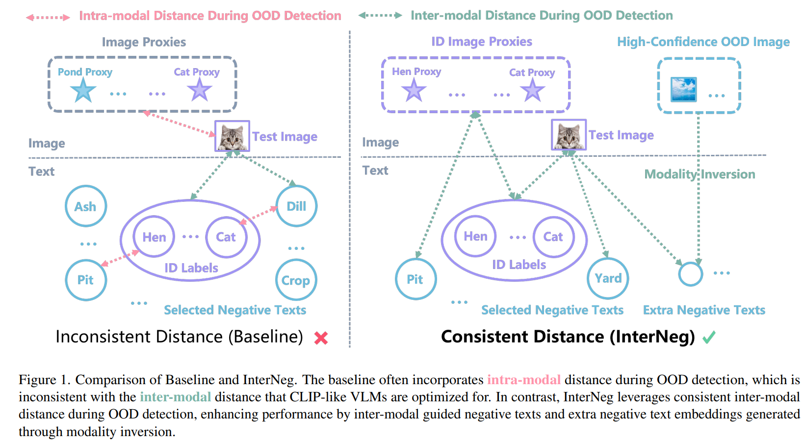
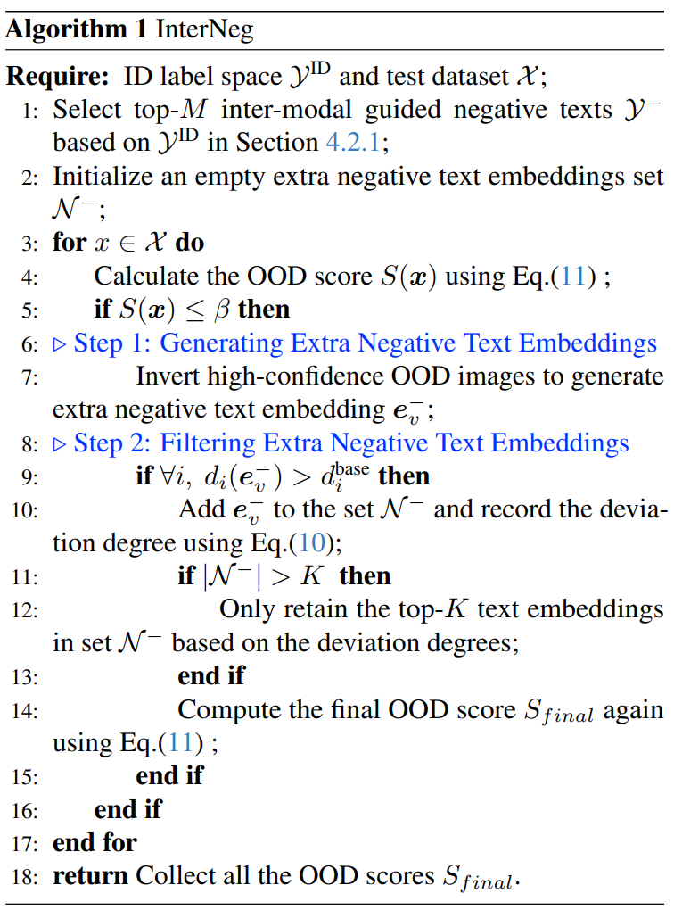

# InterNeg

This repository is the official code for the paper [Mind the Way You Select Negative Texts: Pursuing the Distance Consistency in OOD Detection with VLMs] (CVPR 2026).

**Paper Title: Mind the Way You Select Negative Texts: Pursuing the Distance Consistency in OOD Detection with VLMs.**

**Author: Zhikang Xu, [Qianqian Xu\*](https://qianqianxu010.github.io/), [Zitai Wang](https://wang22ti.github.io/), Cong Hua, Sicong Li, [Zhiyong Yang](https://joshuaas.github.io/), [Qingming Huang\*](https://people.ucas.ac.cn/~qmhuang)**

> Abstract: Out-of-distribution (OOD) detection seeks to identify samples from unknown classes, a critical capability for deploying machine learning models in open-world scenarios. Recent research has demonstrated that Vision-Language Models (VLMs) can effectively leverage their multi-modal representations for OOD detection. However, current methods often incorporate **intra-modal** distance during OOD detection, such as comparing negative texts with ID labels or comparing test images with image proxies. This design paradigm creates an inherent inconsistency against the **inter-modal** distance that CLIP-like VLMs are optimized for, potentially leading to suboptimal performance. To address this limitation, we propose InterNeg, a simple yet effective framework that systematically utilizes consistent inter-modal distance enhancement from textual and visual perspectives. From the textual perspective, we devise an inter-modal criterion for selecting negative texts. From the visual perspective, we dynamically identify high-confidence OOD images and invert them into the textual space, generating extra negative text embeddings guided by inter-modal distance. Extensive experiments across multiple benchmarks demonstrate the superiority of our approach. Notably, our InterNeg achieves state-of-the-art performance compared to existing works, with a 3.47\% reduction in FPR95 on the large-scale ImageNet benchmark and a 5.50\% improvement in AUROC on the challenging Near-OOD benchmark.

 

## Dependencies and Installation

Please follow the instructions below to set up the environment. If you encounter any issues, you can also refer to the [OpenOOD](http://github.com/Jingkang50/OpenOOD) for further troubleshooting.

> conda create -n InterNeg python=3.8.2
> conda activate InterNeg
> pip install -r requirements.txt

## Datasets

Please follow the instructions from [AdaNeg](https://github.com/YBZh/OpenOOD-VLM) to download the training and testing datasets. Once downloaded, update the following paths in the `/configs/datasets/imagenet/*.yaml` files:

- **`data_dir`**: The root directory where the raw image files are directly stored. (Recommended path: `/data`)
- **`imglist_pth`**: The path to the index/annotation files. These files typically contain the mapping information, such as the relative path of an image and its corresponding ground-truth label. (Recommended path: `/data/benchmark_imglist/imagenet`)

## Testing

First, pre-compute the Inter-modal base distance using the code at line 783 in `/openood/networks/clip_fixed_ood_prompt.py`. Alternatively, download it from our [Google Drive](https://drive.google.com/file/d/1BCRNXvZTlEwLE1UCcKuuTUGEmfZtUwlg/view?usp=drive_link) and place it under `/data/txtfiles_output/ViT-B/`.

We provide the evaluation scripts for our method on Four-OOD and OpenOOD benchmarks.

> sh scripts/ood/interneg/imagenet_four.sh 
>
> sh scripts/ood/interneg/imagenet_near.sh 
>
> sh scripts/ood/interneg/imagenet_far.sh 

## Citation

If you find our work inspiring or use our codebase in your research, please cite our work.

```
@inproceedings{Xu2026interneg,
    title={Mind the Way You Select Negative Texts: Pursuing the Distance Consistency in OOD Detection with VLMs}, 
    author={Zhikang Xu and Qianqian Xu and Zitai Wang and Cong Hua and Sicong Li and Zhiyong Yang and Qingming Huang},
    booktitle={Conference on Computer Vision and Pattern Recognition},
    year={2026}
}
```

## Acknowledgements

Our code is based on the [OpenOOD](https://github.com/Jingkang50/OpenOOD) and [AdaNeg](https://github.com/YBZh/OpenOOD-VLM) repositories. We sincerely thank the authors for their excellent open-source work.